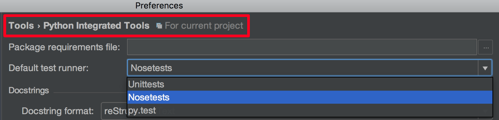
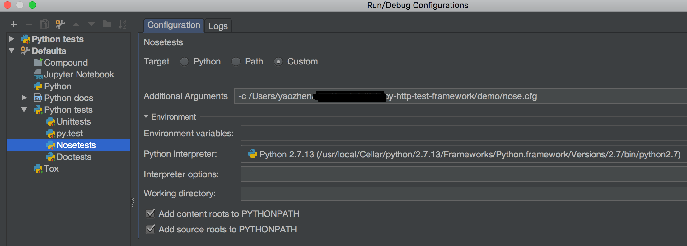
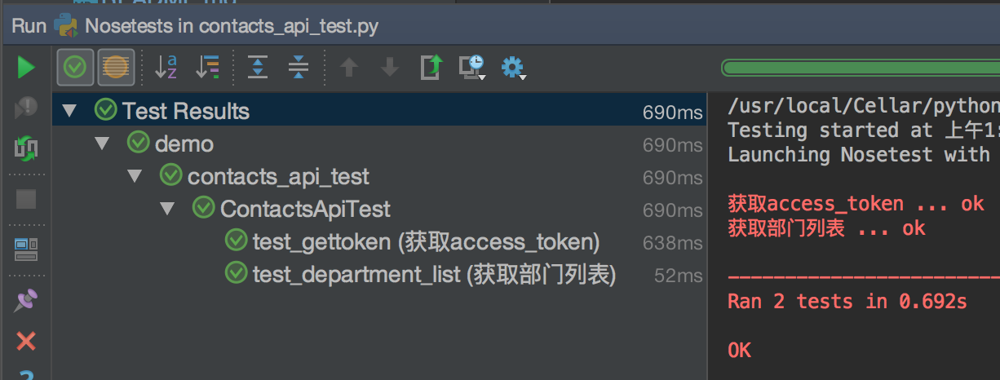

py_http_api_test
===

[](https://www.python.org/)
[](https://travis-ci.org/iyaozhen/py-http-test-framework)
[](https://codecov.io/gh/iyaozhen/py-http-test-framework)

一个基于 Python Nose 的轻量级 HTTP Api 测试框架

设计思路
---
主要解决了 HTTP 接口测试中的三大问题：
  1. HTTP 接口多种多样，测试程序如何统一？
  2. 测试程序如何规范组织？
  3. 接口间有上下文依赖，如何解决？

详见：[《使用 Python nose 组织 HTTP 接口测试》](https://iyaozhen.com/use-python-nose-to-http-api-test.html)

使用方法
---
下载代码，将 `py_http_api_test` 文件夹（模块）复制到项目中。

然后和写普通单测 case 一样，测试类需要继承 HttpTest（from py_http_api_test.http_test import HttpTest），HttpTest 主要是初始化了一个 http_session（Http 会话） 对象和注入了配置文件，一个测试方法完成一个接口测试。

#### 示例（demo/contacts_api_test.py）：

```Python
#!/usr/bin/env python
# -*- coding: utf-8 -*-

from nose.tools import assert_greater_equal
from nose.tools import assert_is_not_none
from nose.tools import eq_
from nosedep import depends

from py_http_api_test.http_test import HttpTest
from py_http_api_test.jmespath_custom import search as jq_


class ContactsApiTest(HttpTest):
    """
    通讯录接口测试
    https://open-doc.dingtalk.com/docs/doc.htm
    """
    access_token = None

    def test_gettoken(self):
        """
        获取access_token
        :return:
        """
        params = {
            'corpid': self.__class__.config['corpid'],
            'corpsecret': self.__class__.config['corpsecret']
        }

        response = self.__class__.http_session.request(
            'GET',
            self.__class__.config['dingtalk_oapi'] + '/gettoken',
            params=params
        ).json()

        self.__class__.access_token = jq_('access_token', response)

        eq_(jq_('errcode', response), 0)
        assert_is_not_none(self.__class__.access_token)

    @depends(after='test_gettoken')
    def test_department_list(self):
        """
        获取部门列表
        :return:
        """
        params = {
            'access_token': self.__class__.access_token,
            'id': self.__class__.config['department_parentid']
        }

        response = self.__class__.http_session.request(
            'GET',
            self.__class__.config['dingtalk_oapi'] + '/department/list',
            params=params
        ).json()

        eq_(jq_('errcode', response), 0)
        assert_greater_equal(len(jq_('department', response)), 1)

```

因为框架基于 nose，所以还可以直接使用需要的 nose 插件，比如 demo 中的 [nosedep](https://github.com/Zitrax/nose-dep) 插件。

为了运行方便，建议使用 `nose.cfg` 来简化运行时的参数。

```INI
[nosetests]
verbosity=2
nocapture=1
with-nosedep=1
no-byte-compile=1
[others]
env=demo/online.yaml
```

这样就能使用 `nosetests -c demo/nose.cfg demo` 运行测试 case 了，运行结果：

```
$ nosetests -c demo/nose.cfg demo
获取access_token ... ok
获取部门列表 ... ok
 
----------------------------------------------------------------------
Ran 2 tests in 0.275s
 
OK
```

从上面的 `nose.cfg` 可以看出 `env`（全局配置文件） 的注入，使用了相对路径，实际项目中建议使用绝对路径，因为 `nosetests` 执行时的目录不好确定。

Demo 只展示了一种配置文件的注入方式，其实还有另外几种（查找顺序排序，找到后不再继续）：
  - `nosetests` 命令运行时直接使用的 `-env=/path` 参数指定的路径
  - `nosetests` 命令运行时 `-c=/path` 参数指定的 nose 配置文件中 `others.env` 配置指定的路径
  - 系统环境中默认 nose 配置文件中 `others.env` 配置指定的路径
  - 具体测试类中 `self.env` 变量定义的路径

全局配置文件的主要作用是测试 case 和数据解耦合，从而达到指定不同的配置文件就能在不同的环境（QA、RD、online 等）中运行，提高 case 利用率，这样也方便接入继承测试和线上监控平台。

对于接口返回的 json 参数建议使用 `jmespath.py`（json 中的 xpath）解析结果，实践中主要有如下优点：
  - 统一规范，方便协作开发，更多精力放在业务上
  - 字段获取不用判空，代码更简洁和健壮
  - 对于复杂的 json 数据和逻辑，也能通过 jmespath 语法描述清楚，代码更简洁，同时也为之后扩展（如接口测试平台）打下基础（可存储）
  
其它
---
#### 在 PyCharm 中使用：
  1. 把默认的 test_runner 修改为 nosetests
  
  
  2. 增加一个 Nosetests 默认的运行参数，`-c` 指定 `nose.cfg` 的绝对路径（不能是相对路径，因为 test_runner 运行时不在当前项目路径），`nose.cfg` 中的 `env` 配置项也要使用绝对路径
  
  
  3. 测试 case 目录及父目录需添加 `__init__.py` 文件，以使 test_runner 将测试 case 类识别为模块，这样就能单独运行某一个测试 case 了（右键选中，点击 Run 'Nosetests for xxx' 即可），比命令行更方便

运行结果：



#### tools 模块（py_http_api_test/tools.py）

提供了常用的 mock 数据生成和 AES 加解密功能